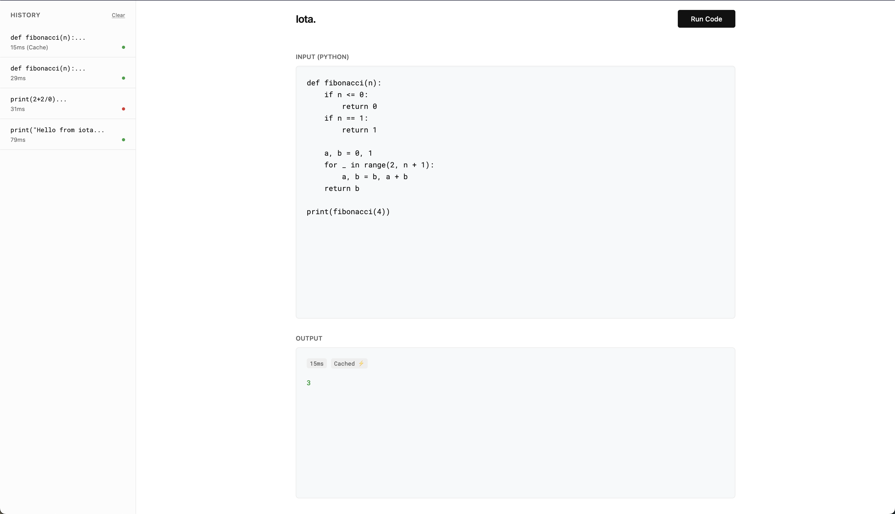

# iota

A local lightweight serverless function as a sevice engine.



# Running

```sh
# build everything (binary + worker images)
make all

# run the api server
make run

# navigate to http://localhost:8080 or send an api request
curl -X POST http://localhost:8080/run \
    -H "Content-Type: application/json" \
    -d '{"type":"code","args":{"language":"python","code":"print(2 + 2)"}}'
```

## Features
- Warm start: Containers are pre-provisioned
- Concurrency: Handles multiple users via channels
- Self-Healing: Recovers automatically if container crashes
- Cached Queries: Optimized retriggers of same code

## todos
- handle code injection
